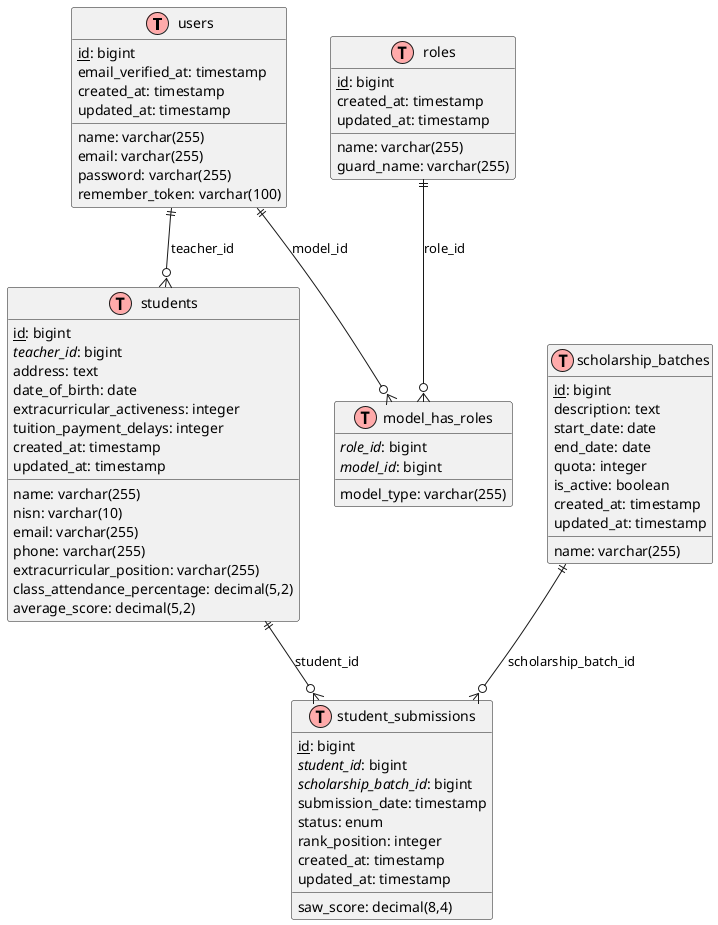
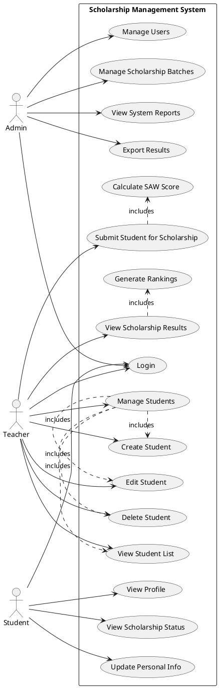
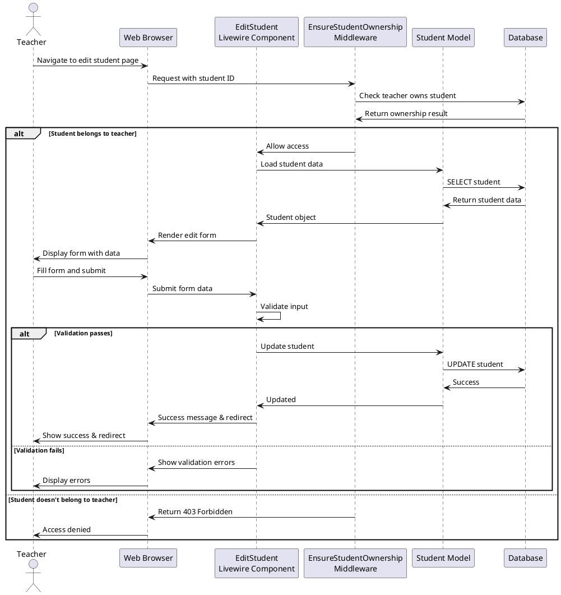
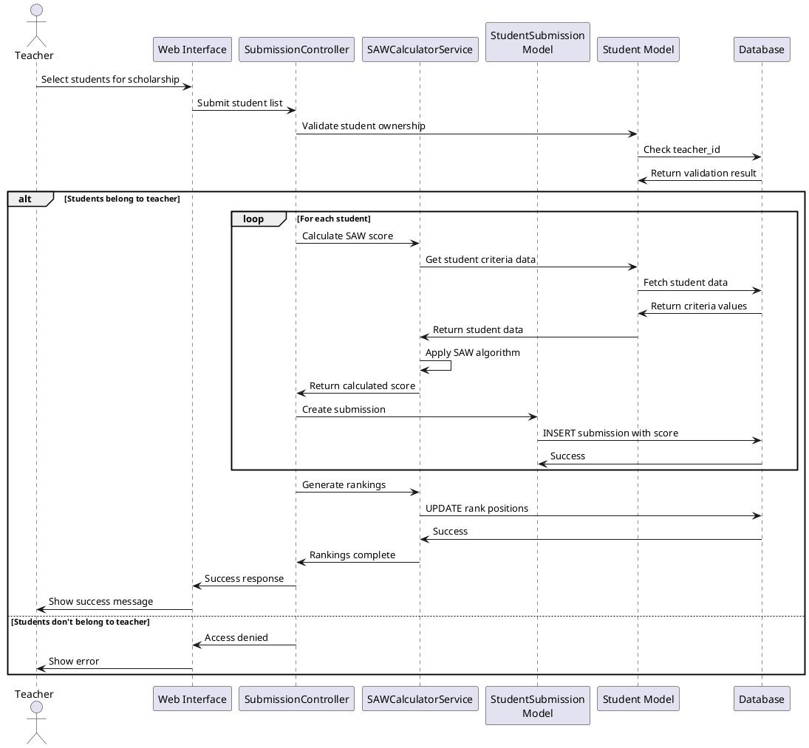
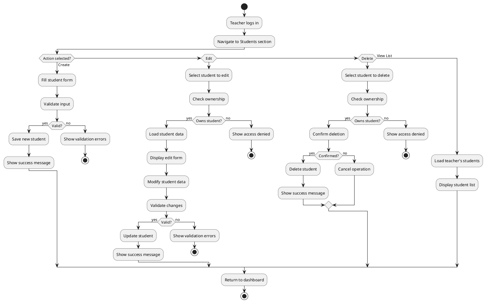
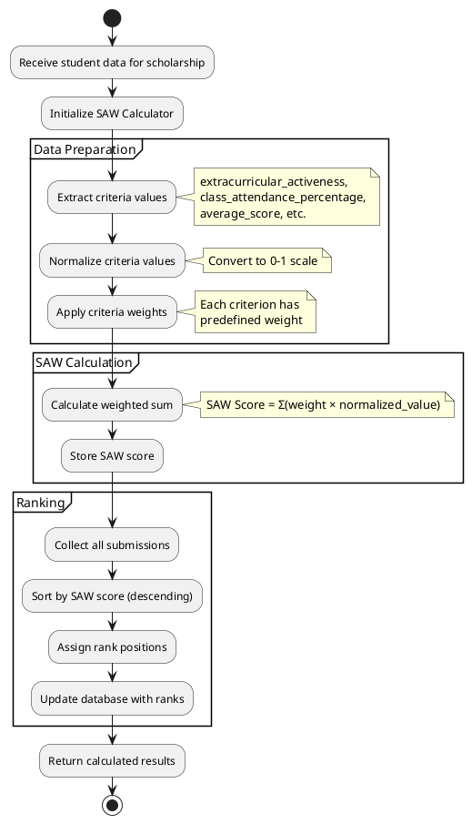
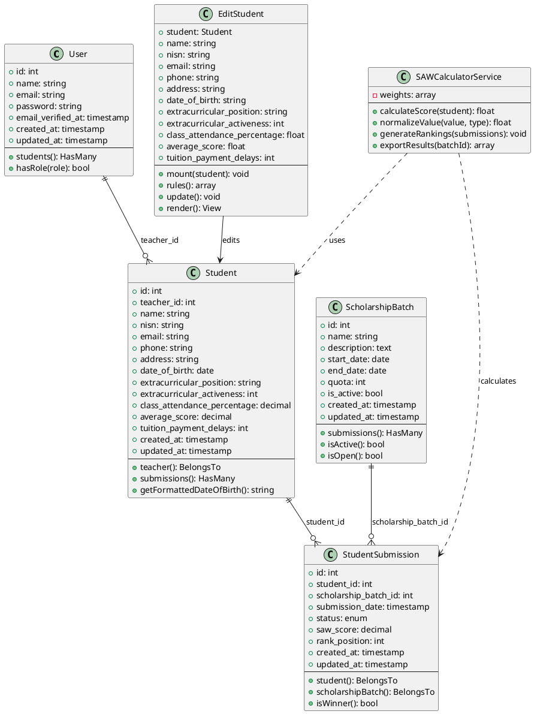
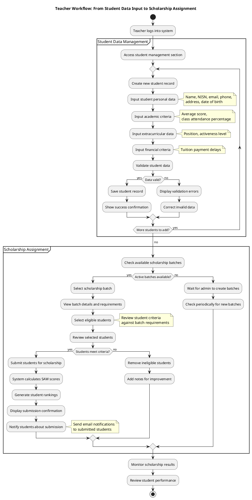
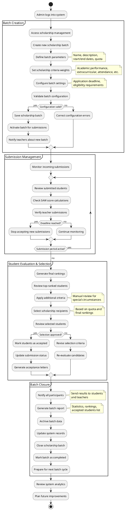

# UML Diagrams for Scholarship Management System

This document contains various UML diagrams for the scholarship management system using PlantUML format.

## 1. Entity Relationship Diagram (ERD)



## 2. Use Case Diagram



## 3. Sequence Diagram - Student Edit Process



## 4. Sequence Diagram - Scholarship Submission Process



## 5. Activity Diagram - Student Management Process



## 6. Activity Diagram - SAW Calculation Process



## 7. Class Diagram - Core Models



## 8. Activity Diagram - Teacher Workflow: Student Data to Scholarship Assignment



## 9. Activity Diagram - Admin Workflow: Batch Creation to Student Acceptance



## Usage Instructions

1. Copy each PlantUML code block (between the ```plantuml markers)
2. Paste it into the PlantUML online editor at https://plantuml.com/plantuml/
3. Click "Submit" to generate the diagram
4. You can export as PNG, SVG, or other formats

## Diagram Descriptions

- **ERD**: Shows the database structure and relationships between tables
- **Use Case**: Illustrates system functionality from user perspectives
- **Sequence (Edit Student)**: Shows the flow of editing a student record
- **Sequence (Scholarship)**: Shows the scholarship submission and SAW calculation process
- **Activity (Student Management)**: Shows the workflow for managing students
- **Activity (SAW Calculation)**: Shows the SAW algorithm execution flow
- **Activity (Teacher Workflow)**: Shows the complete teacher workflow from inputting student data to assigning them to scholarship batches
- **Activity (Admin Workflow)**: Shows the complete admin workflow from creating scholarship batches to accepting students and closing batches
- **Class Diagram**: Shows the object-oriented structure of core system components
